# Victory Fitness

### A website for a personal trainer, gym, and coaching center located in Tralee, Ireland.

[Victory Fitness - Live Website](https://ryael.github.io/victory-fitness/)

A healthy body is a healthy mind, and it is through exercise that we achieve both. However, even if the benefits of exercise are endless, it's something many struggle with due to hectic lifestyles nowadays. Between work, family, friends, and rest, it can be so difficult to find time to consistently exercise. This is where Victory Fitness comes in. Many people have this misconception that when you exercise, you need to allocate a significant amount of time to it, but the reality is that all you really need is 30-60 minutes 3 or 4 times a week. Victory Fitness puts you first and helps you find a work-out and time that suits you, no matter how busy your day to day life is. With sessions starting as early 6AM and ending as late as 9PM, there's a time that'll suit everyone. The coaches will help you stay motivated and on-track to your goals, helping you commit to a plan long enough such that you see real results.

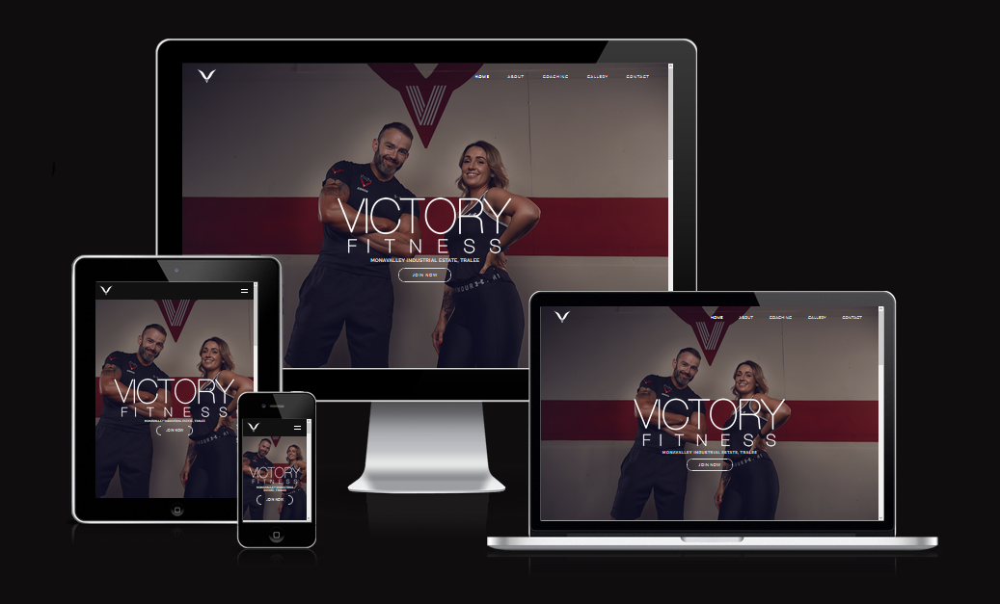

This is my first milestone project as part of Code Institute's Diploma in <strong>Software Development (E-commerce Applications)</strong>.

After much contemplation, I decided to focus on Victory Fitness because of my own love for both exercise and the quality of the services provided by Ronan Kiely of Victory Fitness. I spoke to him directly, and he, as the founder and director, gave me full permission to base this project on his business. All logos, photos, and even some of the text content was provided to me for the sake of the project. There is an existing website but Ronan Kiely wanted to see my approach, putting emphassis on my using of some professionally taken photos.

There was and will be no exchange of funds, as this was agreed to be solely for the sake of the this project. However, I treated Ronan Kiely as my client and discussed many aspects of the website to see what he would prefer and wouldn't prefer to be included. I worked closely with him so as to make sure this website portrays the correct represenative of Victory Fitness, its brand, and its ethos.

The website is fully responsive at all screen sizes, adapting well to smaller resolutions for tablets, phones, and even landscape view on the aforementioned. It also works as intended on all popular web browsers.

This website is a multi-page website that has a consistent design throughout all its pages, and is both simple and pleasing to navigate. All of the content present adheres to Victory Fitness's vision, only contains what is necessary, such as the different coaching services available, an about section detailing the history, a contact-form and details, links to the social media, a google-map showing the location, and a gallery showcasing the inside of the gym itself.

## Table of Contents

1. [Project Goals](#project-goals)
    - [User Goals](#user-goals)
    - [Site Owner Goals](#site-owner-goals)
2. [User Experience](#user-experience)
    - [Target Audience](#target-audience)
    - [User Stories](#user-stories)
3. [User Interface](#user-interface)
    - [Design Philosophy](#design-philosophy)
    - [Fonts](#fonts)
    - [Wireframes](#wireframes)
4. [Features](#features)
5. [Validation](#validation)
    - [HTML Validation](#html-validation)
    - [CSS Validation](#css-validation)
6. [Testing](#testing)
    - [Accessibility](#accessibility)
    - [Performance](#performance)
    - [Device Testing](#device-testing)
    - [Browser Compatibility](#browser-compatability)
    - [Testing User Stories](#testing-user-stories)
7. [Bugs](#bugs)
8. [Future Updates](#future-updates)
9. [Deployment](#deployment)
10. [Technologies Used](#technologies-used)
    - [Languages](#languages)
    - [Frameworks & Tools](#frameworks-&-tools)
11. [Credits](#credits)
12. [Acknowledgements](#acknowledgements)

## Project Goals

The aim of this project is two-fold:
- To demonstrate my knowledge HTML and CSS languages, documenting my experiences, difficulities, and solutions. No other languages or frameworks were used in the development of this project.
- To adhere to the vision of Victory Fitness from a UI/UX perspective, creating a website that aptly represents this enterprise throughout all of the content and formatting.

The latter of which will allow Ronan Kiely to further extend his reach online in promoting Victory Fitness to potential clientele.

### User Goals

- Find a personal trainer and/or gym located in County Kerry.
- Find a personal trainer and/or gym where you can consistently and reliabely exercise.
- Find a personal trainer and/or gym where there's a clear sense of motivation and camaraderie.
- Find a personal trainer and/or gym that will help you achieve your fitness goals.
- Find the personal trainer location and contact details.
- Contact the personal trainer via the online form on the contact page.
- Read about the history of the personal trainer and/or gym.
- Check the coaching services provided.

### Site Owner Goals

- Promote their coaching services and gym online.
- Provide their contact details for the users of the website.
- Provide the online form of contact with a 7-day free trial.
- Show the available coaching services for existing and potential new customers.
- Provide links to the gym's social media.
- Make the website responsive for mobile devices, as [over 50% of traffic comes from mobile users](https://www.statista.com/statistics/277125/share-of-website-traffic-coming-from-mobile-devices/).
- Increase profits by gaining more clientele, allowing for enhancement of the gym.

[Back to Top &uarr;](#victory-fitness)

## User Experience 

### Target Audience

- People who are looking to be the best version of themselves.
- People who lead busy lives but are looking to find a compromise between that lifestyle and exercise.
- People who are looking for a high quality personal trainer, gym, and bespoke plan.
- People who want to exercise in a quiet and clean gym environment.
- People who are looking for an extra bit of a motivational push to help them achieve their fitness goals.

### User Stories

#### First Time Visitors

1. As a first time visitor, I want to easily understand the main purpose and ethos of the gym.
2. As a first time visitor, I want to easily navigate the page to find all the revent information.
3. As a first time visitor, I want to learn about the gym and its history.
4. As a first time visitor, I want to learn where the gym is located.
5. As a first time visitor, I want to know when I can book my session.
6. As a first time visitor, I want to know how to best contact the gym.

#### Returning Visitors

7. As a returning visitor, I want to quickly check the coaching services offered and the differences between them.
8. As a returning visitor, I want to quickly access all of the social media to find any changes in opening times.
9. As a returning visitor, I want to check if the 7-day free trial offer is still available.
10. As a returning visitor, I want to see if there are any new promotions available.
11. As a returning visitor, I want to easily find the location of the gym via the google map section.
12. As a returning visitor, I want to see if any professional photoshoots have been uploaded to the gallery since my last visit.

#### Site Owner

13. As the site owner, I want to clearly showcase the different coaching services available and the differences between them.
14. As the site owner, I want users to navigate the website smoothly and easily.
15. As the site owner, I want to provide photographs of the inside of the gym and the facilities available.
16. As the site owner, I want to provide contact details for users.
17. As the site owner, I want to provide links to the gym's social media accounts.
18. As the site owner, I want to provide users with a free, no commitment, 7-day trial upon filling out the online form.

[Back to Top &uarr;](#victory-fitness)

## User Interface

### Design Philosophy

The design of this website began with this [one image](docs/features/hero-image.jpeg). As soon as I saw it, the design of the website began to take form in my mind's eye. My vision was to use this photograph as the centerpiece for the website. As such, it was fashioned into a fullscreen hero image. It's cropped such that the V part of the logo at the top of the photograph redirect the user's attention to the text logo in the center, with the coaches either side of it. It establishes the brand image quickly, simply, and cleanly. I darkened the hero-image via the use of a dark linear-gradient at 30% opacity to help enhance the contrast between the image and all text, including the navgation links as well as the text logo and address.

The home page takes the approach where all of the content in the body occupies approxtimately 70% of the width available on the page. The about, coaching, gallery, and contact pages meanwhile take a different albeit consistent approach with a much [shorter hero image](docs/features/hero-small-image.png). This is to establish a sense of flow familarity with the design of the website for new users. This is then further accompanied by a transparent navigation bar on wider resolutions, a black-background hamburger menu for smaller resolutions, and a light grey footer. The footer is the same throughout all of the website at all viewpots. The about, coaching, gallery, and contact pages take a very similar approach to the home page in the design of their bodies, using approximately 70% of the available width on larger resolutions. However, where they differ is in how images are displayed: background images always occupy 100% of the available width, whereas inline images only occupy the same amount of width as the body. This is a conscious design decision to allow for the body text to sleekly wrap under any images present, allowing for a neat and tidy viewing experience.

On smaller viewports, the content expands to 80-100% of the width to reduce the necessity to keep scrolling and to allow for easier viewing. 

The 404 and Thank You pages employ a similar design philsophy to that of the home page in using a fullscreen hero image, but where they differ is in that the opacity of the layer of the dark gradient is increased from 30% to 50% to draw less focus to the images themselves and more to the message being delivered as well as a button in how to return to the general browsing of the website.

You can find the images used for all pages below:

    
Home

    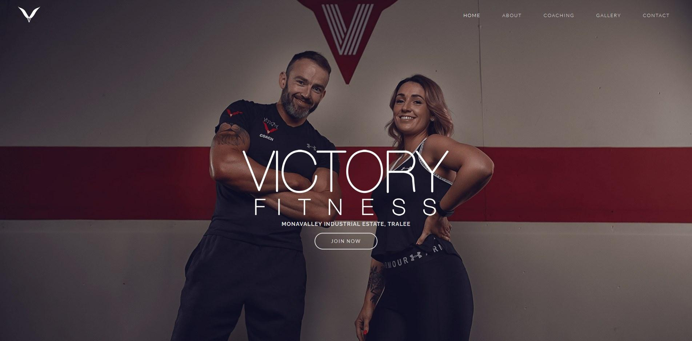

    
About, Coaching, Gallery, and Contact

    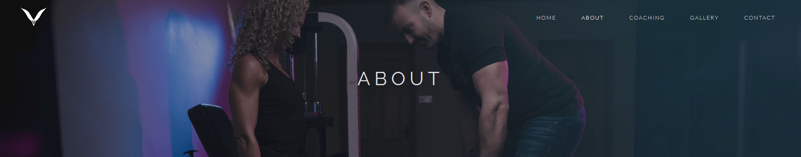

    
404

    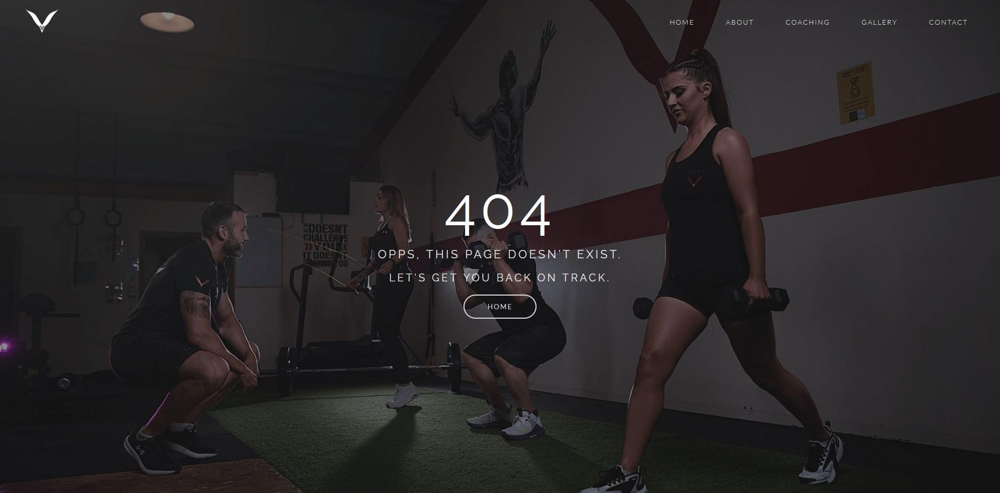

    
Thank You

    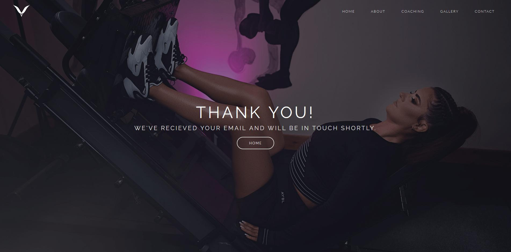

### Colours 

No pre-set colour palettes were used in the designing of this website, as my goal was to create a monochromatic look, focusing mostly using blacks, whites, and grays. My vision was to have it be simple, clean, and elegant. [Color-Name](https://www.color-name.com/) was used to find slightly lighter and darker shade variations of the colours used for this project. The body content is primarly grey text on a white background with black titles, sometimes being inverted to white for sections that rely on background images. 

### Fonts

The fonts I chosen for this were Lato and Railway. Lato is the font for the general content, whereas Railway is used for title content. They complement each other well and they were chosen because they were recommened by [this website](https://www.coralnodes.com/best-google-font-combinations/). A close second was the combination of Montserrat and Source Sans Pro, which evoke a similar sense of simplicity and elegance. However, I ultimately chose to go with Lato and Railway due to how well Railway works with letter-spacing. It's a modern and clean approach, which I believe works for just about any website.

Font-weights of 300, 400, and 700 were chosen for both fonts. 300 was used as the default for both, with 400 being used for a bit more weight and clarity, and with 700 being used in rare cases where a bold or strong element was required for the text.

Normally, one would associate big and powerful fonts and font-weights with gyms and working-out, however, I wanted to adhere to my initial vision in designing a clean and elegant website. This represents my core values better as well as reinforcing the idea that the gym is clean and well-maintained, and the coaches are both elegant and well-spoken.

### Wireframes

The conceptualisation of the layout used in this project began with simple pen and paper sketches, which were then transformed into wireframes via Balsamiq. Everything shown here is a rough beta of the layout, some of which has changed during development.

### Wireframes
This is the prototype of the project that may change during its development.

    
Home

    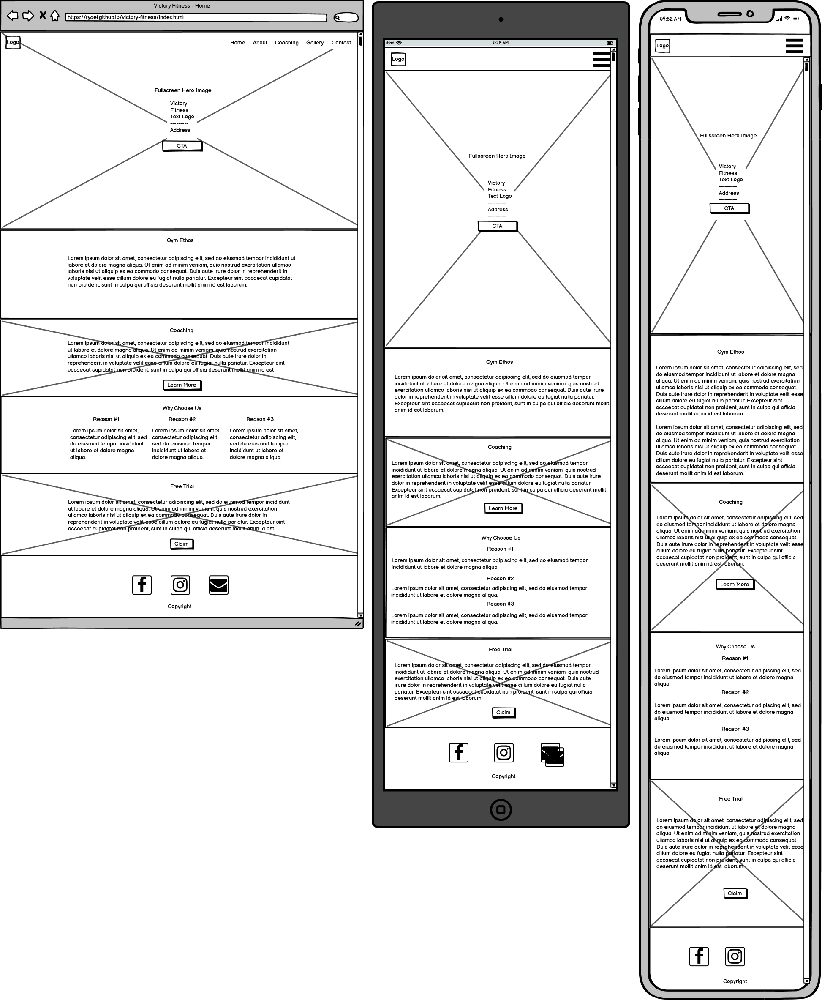

    
About

    

    
Coaching

    

    
Gallery

    

    
Contact

    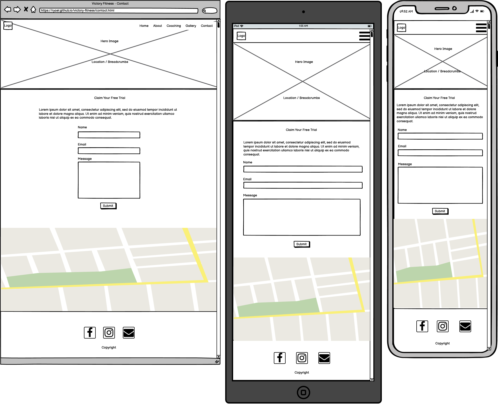

    
Thank You

    

    
404

    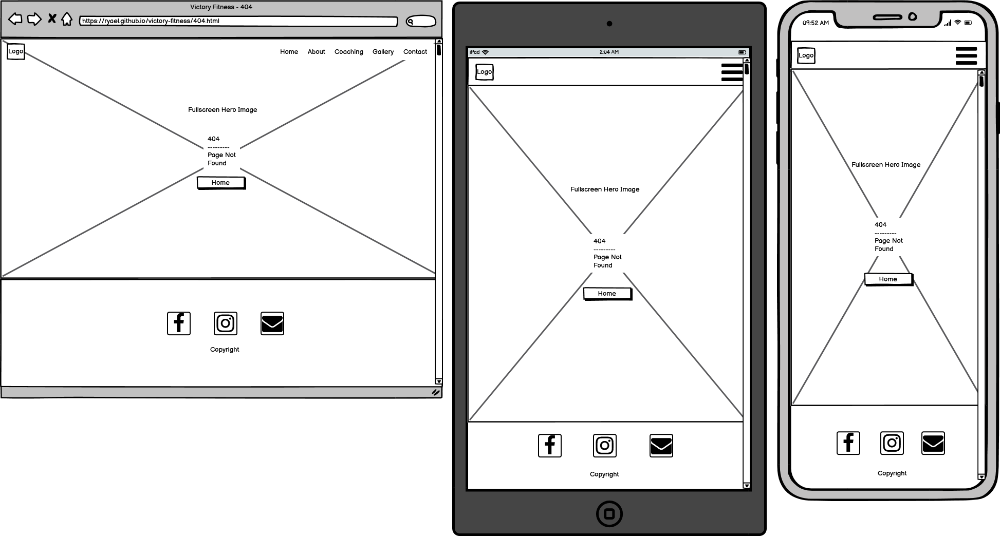

[Back to top &uarr;](#victory-fitness)

## Features

### Navigation Bar

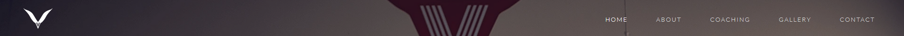

Every single page on the website has this navigation bar at the very top. Due to the darker hero-images behind it, it's easy to see even if it itself is fully transparent. It's very simple and iniquitive, focusing primarily on the function of allowing users to effectively navigate the website. The current page is highlighted in a brighter white than the rest of the links, which are displayed in a more gray colour. The Victory Fitness logo is a link that re-directs the user to the home page. For smaller viewports, a hamburger menu appears with a black background, to make the links easier to see and interact with. This makes it fully responsive across all viewports.

This hero image is the foundation on which the entire website was built on. It perfectly encapsulates the brand and vision of Victory Fitness and aptly summarises into a singular image. It is the very first thing new users see and it's ultimately the deciding factor whether or not those new users will continue to interact and explore the website or go somewhere else entirely. First impressions hold a lot of power and that's why a good first impression is incredibly important. This is a crop of a full image that puts focus on the white letter "V" with the red logo V itself, which draws the user's attention towards the middle of the screen. This is further enhanced by the two coaches standing side by side, making sure the user's eyes do not escape from where they are being drawn to. That brings the user to the Victory Fitness text logo, and subsequently, the address of the gym. With just one look, in the matter of seconds, the brand and reputation of the gym is established, from which the user is able to form an impression, as well as the knowledge of where the gym is located. To add to this, a Call to Action button is located under the address, which brings them to the Contact page, where they can avail of a 7 Day Free Trial.

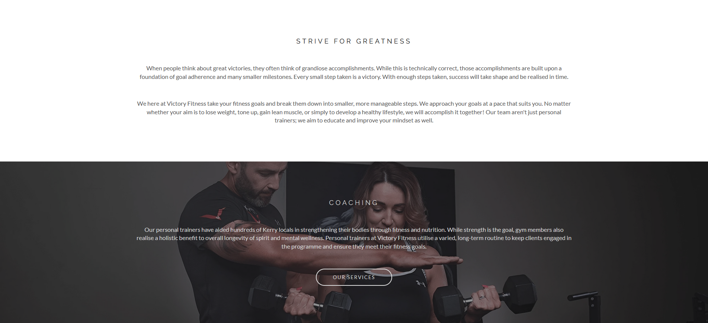

The first half of the home page is a relatively simple section as it offers the user a bit more information about the gym, its ethos, and the services being offered. The full-width image is used to great effect in creating contrast between the white sections above and below, as well as breaking up the text-only content. A button is also present, which inverts its colour schemes upon interaction, giving the user a direct means of accessing the coaching page.

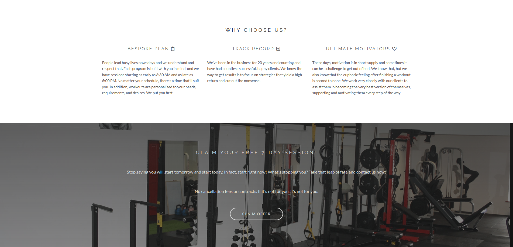

The second half of the home page keeps to the brief introductory sessions that the first half does, providing reasons as to why this gym is worth choosing. This was a direct request from Ronan Kiely, who believes in selling what makes your gym and services special. He dislikes transformation pictures as they tend to create an environment that the only thing that matter is the end, the results. However, there's so much more to it than that. The journey, the starting point, and the struggles, to name some. For this reason, there's no section showing transformations or successes. They may bring great business, but this brand prefers to focus on other aspects of their client's fitness journies.

Below that, there's another section with a full-width background image that helps to break up the text while simultaneously showing the gym off. This section informs the user of a 7-day no commitment free trial, with a call to action button below that brings them to the contact page where they can learn more.

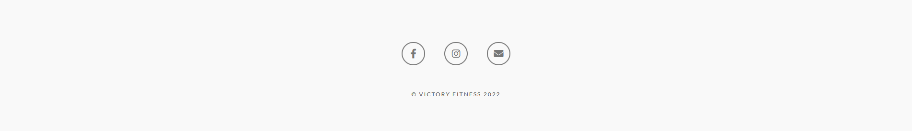

Simiarly to the navigation bar, the footer is also present across all pages. It is also fully responsive across all viewports and houses three icons that provide links to Victory Fitness's social media accounts and email. These buttons change colour upon interaction, and thelinks all open in a new page such that the user isn't made leave the website and can continue exploring. Below these icons, there's a line of text that describes Victory Fitness as the copyright holder for this website.

As mentioned earlier, the About, Coaching, Gallery, and Contact pages utilise a much shorter hero image. This is to bring the user to the content of these pages much quicker and to make navigate a lot more fluid as having to navigate a full-height viewport image upon loading every page can be quite cumbersome. This section also serves as a darker backdrop for the transparent navigation bar and houses location title text within, informing the user of what section they just navigated to.

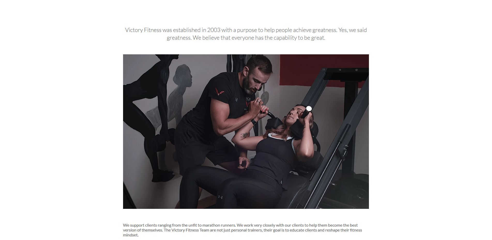

The About page provides the user with a detailed history of Victory Fitness, a more in-depth dive into their ethos as a gym and coaching service, which is supported by a photograph of the two coaches in the gym. The text content here uses the same amount of width as the image, allowing for a very fluidic experience in reading the content.

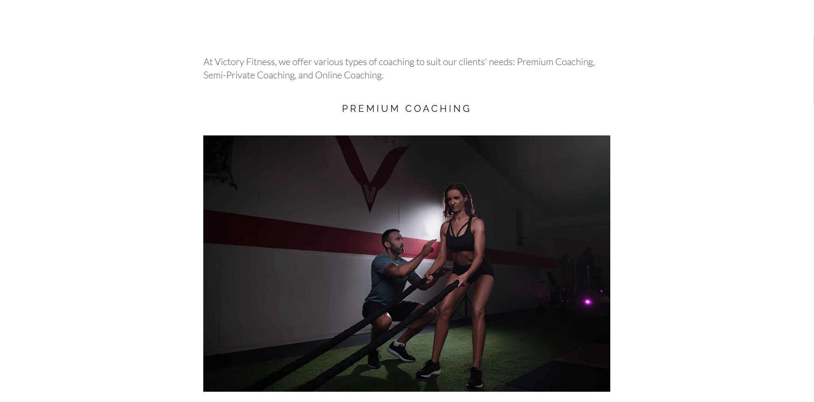

The Coaching page delves into greater depth regarding the coaching services offered. It's broken up into three sections: 1) Premium Coaching, 2) Semi-private Coaching, and 3) Online Coaching. Each of these sections has a photograph accompanying them. This helps to break up the text from overwhelming the user with information overload. Exactly like the About page, the width of the text content never exceeds the width used by the images.

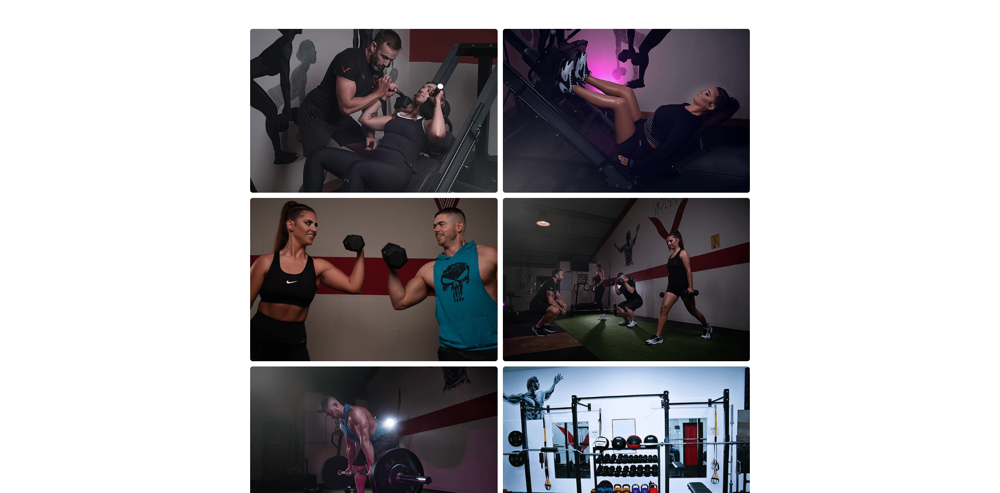

The Gallery page is dedicated to showcasing the gym and all of the available equipment and facitilities, allowing the users to see the gym for themselves aside from the professional photographs. The images are displayed in two columns and are fully responsive across all viewports, shrinking down to one column as the viewport grows narrower. 

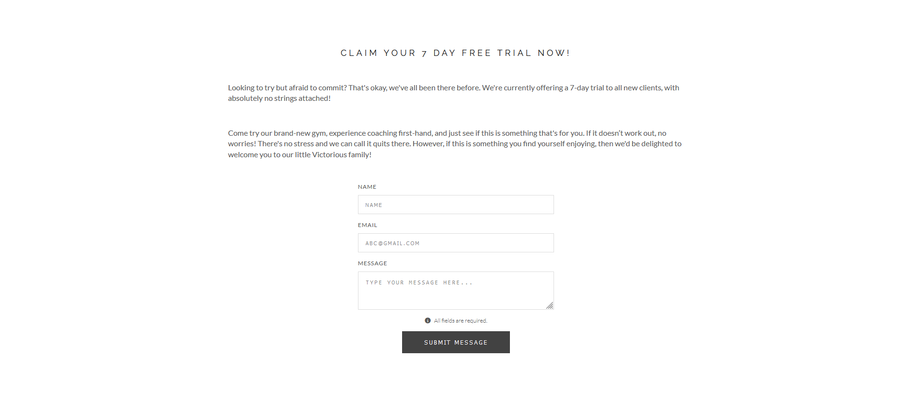

The Contact page allows users to get in touch with Victory Fitness directly via filling out of the online form. Users are also told more about the free trial and can avail of it by filling out the aforementioned form. The form has both labels and placeholder text in place, ensuring both accessibility and clarity. A line of text below the form-fields informs the user that all fields are required to be filled out in order for the form to be successfully submitted. The details submitted aren't stored as the user is simply redirected to the Thank You page.

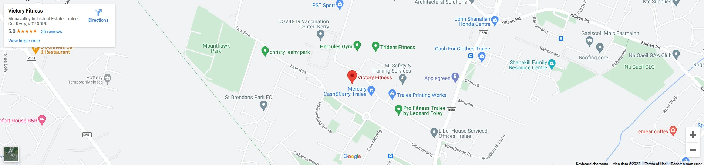

The Google Maps section of the Contact page informs users of where the gym is located, should they want to take a trip to it to see it first-hand. Photographs are great, but seeing it in person is even better. A face to face conversation with one of the coaches is also a possibility, which tend to be a bit more personal, warmer, and more comfortable than online correspondance. The embed for this maps section is provided by Google itself. Unfortunately, the Google Maps section didn't make it into the final build. It was instead replaced by a static image of the location due to major performance issues.

After successful completion of the form on the Contact page, the user is redirected to this page. It's just a simple thank you message that lets them know their message was recieved successfully and someone will be in touch with them shortly. Any details submitted aren't stored. This page employs the same sort of approach as both the Home page, using a fullscreen hero image with text overlayed on top of it. The only difference here is that the opacity is increased to 50% to bring the viewer's attention to the message being brought in front of them.

Should the user navigate to a page that doesn't exist, a HTTP 404 error will occur. Upon doing so, the 404 Page will be loaded, informing the user that this page does not exist. All the usual means of navigation are present in the navigation bar and the footer, but with the addition of a button to take them home. This is located under the error text. This page employs the same sort of approach as both the Home and Thank You pages, using a fullscreen hero image with text overlayed on top of it.

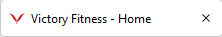

As with all websites, this one also has a favicon that is display beside the title of the page. A user is able to discern what pages they have opened or are currently on by simply glancing at the tabs and titles.

[Back to top &uarr;](#victory-fitness)

## Validation

### HTML Validation

[W3C Markup Validation Service](https://validator.w3.org/nu/) was used to validate HTML code. No errors were found. Please see the summaries below for the results.

    
Home

    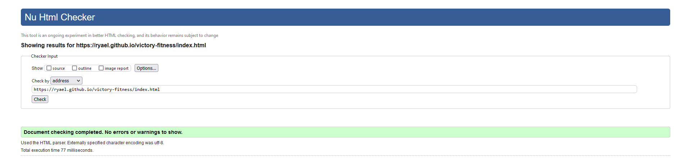

    
About

    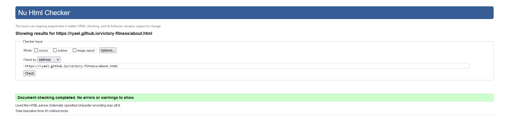

    
Coaching

    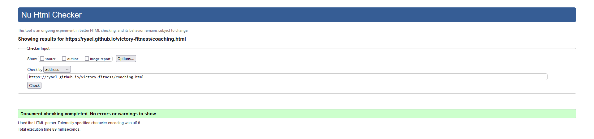

    
Gallery

    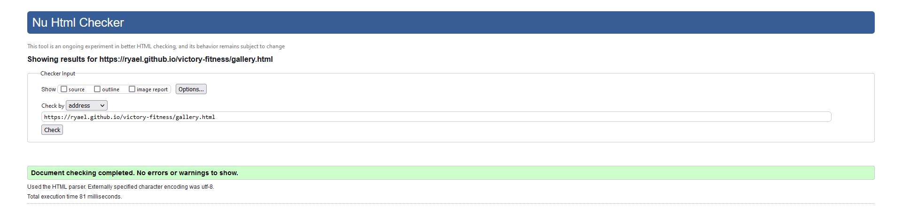

    
Contact

    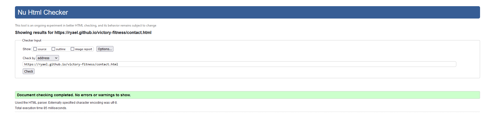

    
Thank You

    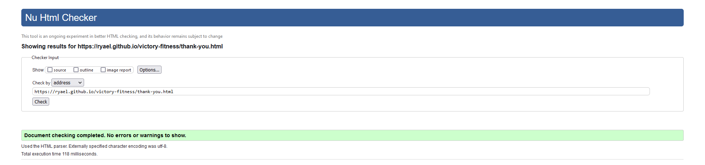

    
404

    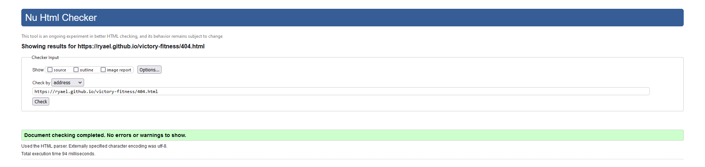

### CSS Validation

[W3C CSS Validation Service](https://jigsaw.w3.org/css-validator/) was used to validate CSS code. No errors were found. 

    
Style Page

    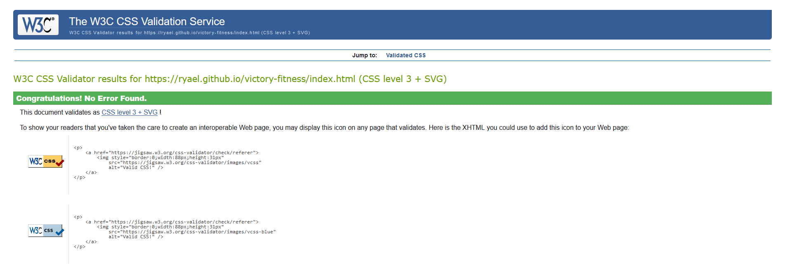

[Back to top &uarr;](#victory-fitness)

## Testing

### Accessibility

[WAVE WebAIM](https://wave.webaim.org/report#/https://ryael.github.io/victory-fitness) was used to validate CSS code. One error was found and this was relating to the hamburger menu having an empty label, this was fixed and is covered in the bugs section. Otherwise, there were some contrast errors that came up and they were simply fixed by increasing the colour of the fonts used. One such example was changing #777 to #575757, which now passes all accessibility checks.

Additionally, the address below the text-logo as well as the button on the home page are flagged as contrast errors. This also concerns any text on an image-background on other pages. However, attempting to follow the suggestions provided by the tool seemed to impact actual accessibility negatively, despite satisifying the actual tool. Please find a screenshot example of the colour suggestion for said area. As such, these contrast errors will be disregarded as they aren't picked up by Lighthouse.

    
Contrast Error Example

    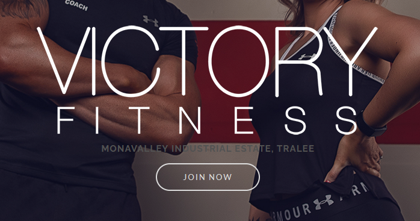

Below are the results for every page, with no errors present (aside from the disregarded contract ones):

    
Home

    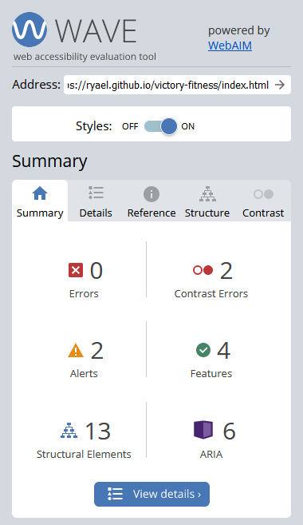

    
About

    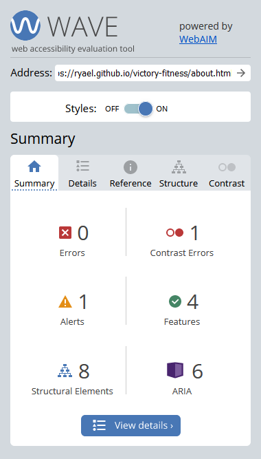

    
Coaching

    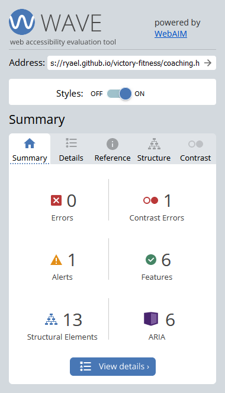

    
Gallery

    

    
Contact

    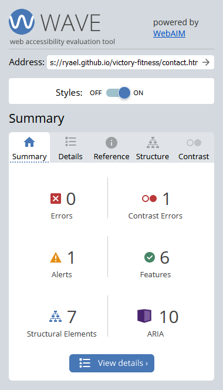

    
Thank You

    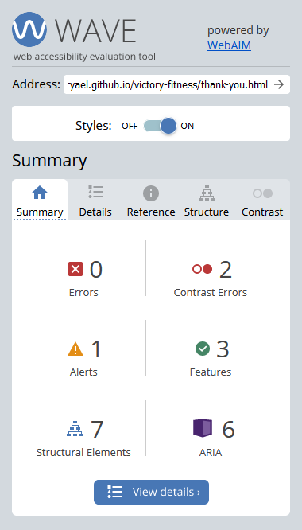

    
404

    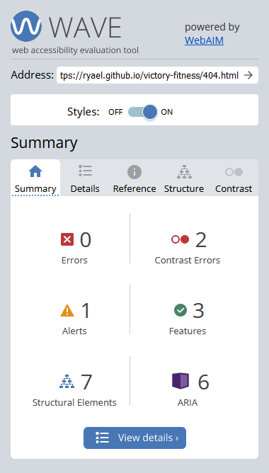

### Performance

Google Lighthouse was used to the performance of all webpages. All pages have a score of 100 Accessibility, 100 Best Practices, and 100 SEO across all devices. Howeever, Performance seems to fluctuate between 72-95 for all pages. Multiple browsers have been used in cognito in order to disable any extensions that could be potentially hindering performance. I looked into this to find that people that had scores of 100 Performance also seemed to produce different result when I tested their websites on my end. Regardless, all web pages have been optimised for load speed and performance, netting in 85-92 scores across the board without any cherry-picking.

The results can be seen below.

    
Home

    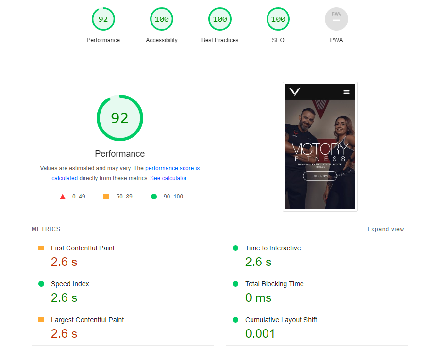

    
About

    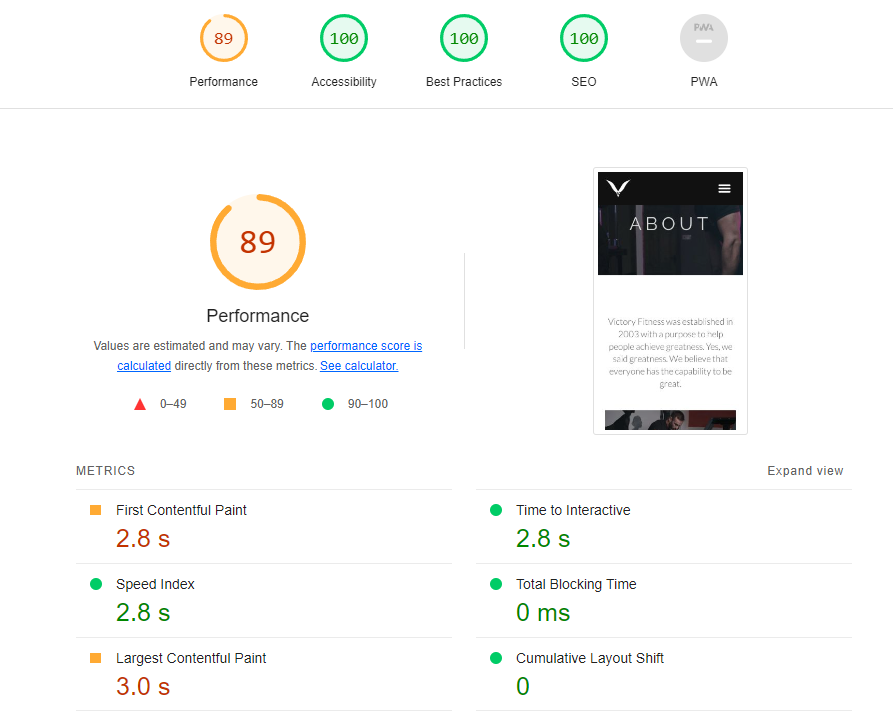

    
Coaching

    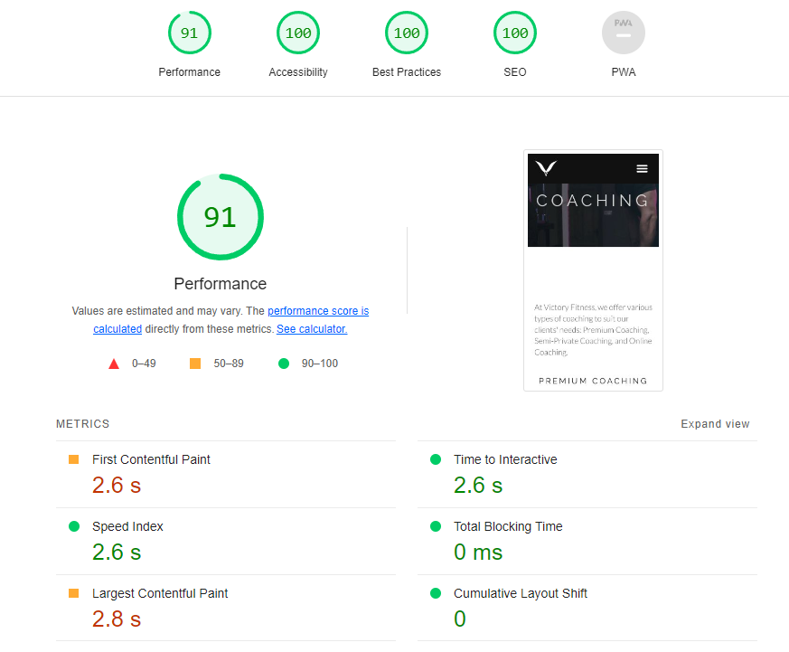

    
Gallery

    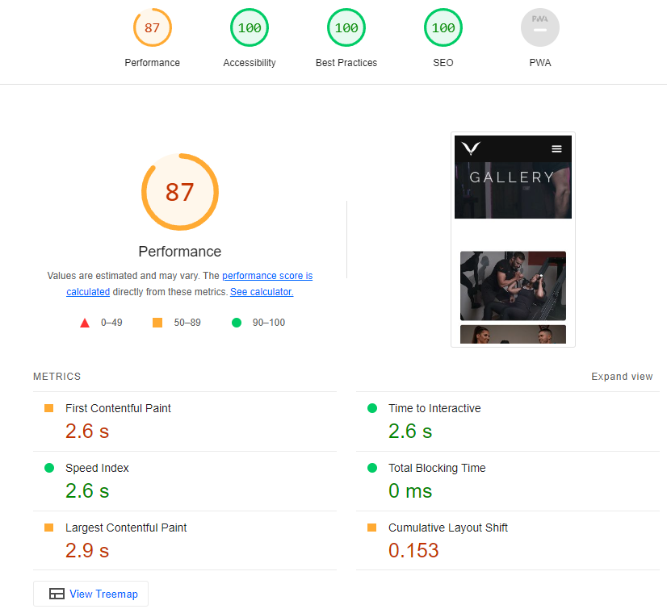

    
Contact

    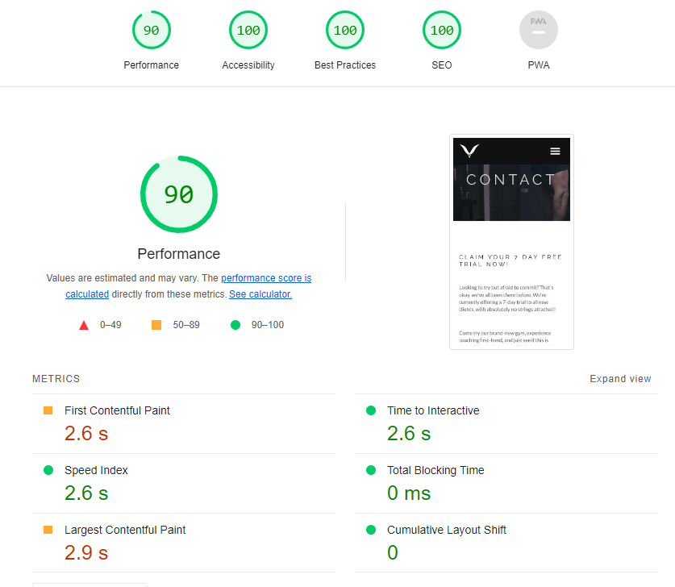

    
Thank You

    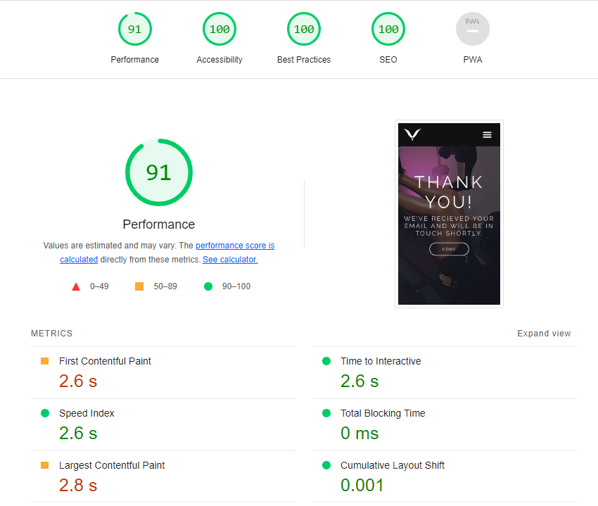

    
404

    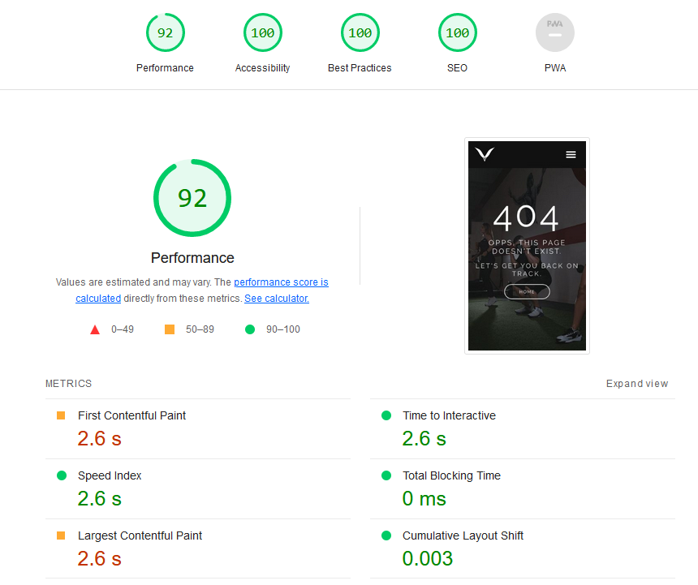

### Device Testing

The website was tested on many different devices, such as:

- Samsung Galaxy S10
- Samsung Galaxy S21
- MSI GE72 6QF Apache Pro
- iPhone 10
- iPhone 12
- iPad Mini (Landscape and Portrait)
- iPad (Landscape and Portrait)
- Vivo S1 Pro

### Browser Compatibility

- Mozilla Firefox
- Google Chrome
- Opera
- Safari
- Microsoft Edge

### Testing User Stories

1. As a first time visitor, I want to easily understand the main purpose and ethos of the gym.
    - Upon navigating to the website, the user is automatically greeted with a clean and easily readible navigation bar to go to their page of choice. The Hero Image and Call to Action button draws the user's attention and starts to establish the gym's brand and purpose.
    - At this point, users can navigate to another page, in this case About, or scroll down, both of which will delve into the ethos of the gym.

2. As a first time visitor, I want to easily navigate the page to find all the revent information.
    - The website was designed to be easily navigatable and fluid. The top of each page has a navigation bar, with clearly described links so the user has an idea of where they'll end up upon interacting with them.
    - There are Call to Action buttons present throughout the website that help with funnelling the user into any topic they might be interested in.
    - Upon successful submitting of the form on the Contact page, the user is brough to a Thank You page. They then have the option to interact with the links on the navigation bar or the button below the thank you text.

3. As a first time visitor, I want to learn about the gym and its history.
    - Upon reading the "Strive for Greatness" section on the home page, or even after they finish reading the home page, they can then navigate to the About page via the navigation links. Here, they can find more information on the gym, its ethos, and its history.

4. As a first time visitor, I want to learn where the gym is located.
    - The user is instantly introduced to where the gym is located based on the title text present on under the Victory Fitness text logo on the home page.
    - Furthermore, there's a detailed google map on the Contact page, allowing to establish a solid understanding of the location.

5. As a first time visitor, I want to know when I can book my session.
    - Due to the fluidic nature of the home page, the user will arrive at the Why Choose Us section which will provide details of when sessions can be booked.
    - Additionally, between the About and Coaching pages, information is laid out in a way that makes the user understand that clients are put first and a time that suits them can be worked out.

6. As a first time visitor, I want to know how to best contact the gym.
    - Once the user has read any page, they'll find icons in the footer that link to the gym's social media accounts and email.
    - Additionally, if the user has navigated to the Contact page via the navigation links or the Call to Action button on the Home page, they can find a form to fill out for a 7-day free trial.

7. As a returning visitor, I want to quickly check the coaching services offered and the differences between them.
    - Upon returning to the website, this information can be found via a Call to Action button on the home page, which directs the user to the Coaching page.
    - Here, the user is told about all the coaching services provided in great detail.

8. As a returning visitor, I want to quickly access all of the social media to find any changes in opening times.
    - This is made very easy by the inclusion of the footer, which is present across all pages.
    - Here, the user may find links to the gym's Instagram and Facebook, which are their main social media accounts.

9. As a returning visitor, I want to check if the 7-day free trial offer is still available.
    - Returning to the website, all the user has to do is interact with the "Join Now" Call to Action button on the Hero Image of the Home page, scroll down to see the Contact section which lists the current offer, or navigate to the Contact page which has the full details regarding the current on-going offer.

10. As a returning visitor, I want to see if there are any new promotions available.
    - The newest promotions are always linked to with the Call to Action button on the Hero Image of the Home page.
    - Alternatively, users are incentivised to contact the gym via the form on the Contact page. As such, there is always an offer present there to encourage this.

11. As a returning visitor, I want to easily find the location of the gym via the google map section.
    - This can be accomplished by navigating to the Contact page via Call to Action button part of the Free Trial section on the Home page, or by interacting with the Contact navigation link.
    - Here, the user can find a detailed Google Map detailing where the gym is located.

12. As a returning visitor, I want to see if any professional photoshoots have been uploaded to the gallery since my last visit.
    - All new professional competitions and photoshoots will be uploaded to the Gallery page, which the user can easily navigate to using the links on the navigation bar.

13. As the site owner, I want to clearly showcase the different coaching services available and the differences between them.
    - This is easily accomplished by the Coaching page, which can be quickly accessed via Call to Action button under the Coaching section, or simply navigated to using the navigation bar links.

14. As the site owner, I want users to navigate the website smoothly and easily.
    - The website has a very clear navigation bar, with easily seen links due to the contrast of the background and the colour of the links. This allows for a smooth navigation experience.
    - Each section is built to be fluidic and flow in a coherent manner where the user learns relevant information as they go through each section on each page.

15. As the site owner, I want to provide photographs of the inside of the gym and the facilities available.
    - The Gallery page accomplishes this, allowing the site owner to display whichever photos they may like to their userbase.
    - The Gallery page is also easily accessable due to the easy to use navigation links.

16. As the site owner, I want to provide contact details for users.
    - Users can find contact details in the form of the address on the Home page, the social media accounts in the form of the icons in the footer, as well as an online form on the Contact page.
    - Additionally, a Google Map is also present there should the users want to make a trip there in person.

17. As the site owner, I want to provide links to the gym's social media accounts.
    - The links to the gym's social media accounts are easily found and easily accessible in the footer, which present throughout every page on the website. 
    - No matter where the user is, they're always just a short scroll away from accessing the social media accounts.

18. As the site owner, I want to provide users with a free, no commitment, 7-day trial upon filling out the online form.
    - Often times it can be difficult to convince users to fill out forms as other communication can be easier and more readily available. However, a free trial is more than enough incentive for this.
    - This free trial can be see via the Home page in one of two ways: it can be accessed via the Call to Action Join Now button on top of the Hero Image and/or it can be found in the Free Trial section, which also has its own Call to Action button.
    - Lastly, the users can navigate to the Contact page via the navigation bar links, where they can find all the details regarding the free trial and the form.

[Back to top &uarr;](#victory-fitness)

## Bugs

1. Accessibility Error - Empty Label detected as part of the hamburger navigation menu. 
    - Fix: Add  with text inside the label, and attach a CSS class to this span that uses "display: none;".
    - This satisifies the error as the label is no longer empty, even if the content is never displayed.

2. Font Awesome Icons Displayed Incorrectly on Mobile - Icons seem to have been nudged slightly to the right and downwards.  It's a very minor visual bug. This issue only exists on mobile, specifically the Samsung Galaxy S10. I have been unable to recreate it with other mobile phones. This could have something to do with the OS of the S10. This display issue is the same with FA icons on all websites.
    - Fix: None. I've looked through the internet extensively and nobody seem to have spoken this issue or any similar issues.
    - [Here](docs/screenshots/icon-bug.jpg) is a link to a screenshot of the issue. The icons are slightly off-center.

Otherwise, all bugs were due to my own code and were usually fixed as soon as I saw them due to the fact that they originated from my own mistake. Nothing major, aside from the accessibility error described above.

[Back to top &uarr;](#victory-fitness)

## Future Updates

1. Sticky Navigation Bar - This was part of my vision for the website but I was unable to find a solution to this without relying on JavaScript. My vision is as follows: I wanted the navigation bar to be transparent when it was resting above the Hero Images, but once it left those regions, it would become an opaque black color as it follows the user down the page.

2. Fullscreen Hamburger Menu - This is very difficult to accomplish without JavaScript and I found myself struggling with the current hamburger menu as is. My vision for this was to have the entire screen to be covered in white with links in black structured in a column appearing the middle.

3. Coaching Pricing Plan Comparisons - This was part of the plan for the website but I found myself not having the time necessary to bring this idea to light. Hence, I'd like to work on it in the future and put it at the top of Coaching page, so users are available to compare plans with just a single glance.

4. Google Map - This was originally a part of the website but it caused major performance issues and hence was removed and instead replaced by an image.

5. Testimonials - This was originally a part of the plan for this project but unfortunately, Google Reviews aren't too easy to embed without having to pay for the service. The alternatives are well over my head but it's definitely something I'd like to look into in the future.

I'd like to revisit this project in the future after having learned more about JavaScript, especially if Ronan Kiely of Victory Fitness would be interested in using this website.

## Deployment

This project was deployed to GitHub Pages using the following steps:

1. Log in to GitHub and locate the repository: [Victory Fitness](https://github.com/Ryael/victory-fitness).
2. Locate the Settings button, and then click it.
3. Scroll down to the Pages section, which is found under "Code and automation".
4. Under "Source", click the dropdown called "None" and select "Master Branch".
5. The page will then automatically refresh.
6. Scroll back to the top of the page to locate the now published website link.

It can also be forked via the following steps:

1. Log in to GitHub and locate the repository again, as described above.
2. At the top right corner of the repository, you will see a "Fork" button. Click on it.
3. You will then be asked where you want to save it, so choose a location.
4. You now should have a copy of this repository in your own GitHub account.

[Back to top &uarr;](#victory-fitness)

## Technologies Used

### Languages

- HTML 5
- CSS 3

### Frameworks & Tools

- [GitPod](https://gitpod.io) - IDE used to code and build this project.
- [GitHub](https://github.com/) - The repository was created here, is currently stored here, and was deployed via the GitHub Pages features.
- [Balsamiq](https://balsamiq.com) - Used to create wireframes.
- [Obsidian](https://obsidian.md/) - Used to take notes and creat to-do lists.
- [Adope Photoshop](https://www.adobe.com/products/photoshop.html) - Used to crop, resize, and edit images.
- [W3C HTML Validator](https://validator.w3.org/) - Used to validate HTML code.
- [W3C JigSaw Validator](https://jigsaw.w3.org/css-validator/) - Used to Validate CSS code.
- [WAVE WebAIM](https://wave.webaim.org/) - Used to check accessibility.
- [Google Lighthouse](https://chrome.google.com/webstore/detail/lighthouse/blipmdconlkpinefehnmjammfjpmpbjk) - Used to check performance, SEO, accessibility, and best practices.
- [Mozilla Firefox Developer Tools](https://www.mozilla.org/en-US/firefox/new/) - Used to check and test the project.
- [AmIResponsive](https://ui.dev/amiresponsive) - Used to create the Am I Responsive image mock-up.
- [FreeConvert](https://www.freeconvert.com/jpg-to-webp) - Used to convert .PNG to .WEBP.
- [TinyPNG](https://tinypng.com/) - Used to compress images.
- [Google Fonts](https://fonts.google.com/) - Fonts were imported from here.
- [Font Awesome](https://fontawesome.com/) - Icons are used from here.
- [Favicon.io](https://favicon.io/) - Used to create a favicon out of a .PNG.
- [ShareX](https://getsharex.com/) - Used to take screenshots.
- [Color-Name](https://www.color-name.com/) - Used to find complementary shades of colours used.
- [CoralNodes](https://www.coralnodes.com/best-google-font-combinations/) - Used to find Google Font combinations.

## Credits

1. [Victory Fitness](https://victoryfitnesstraining.com/?ad=ie) - This project was only possible due to Ronan Kiely letting me base this website on his business. He helped provide me with information, text, photographs, logos, advice, and direxction. All of the content belongs to Victory Fitness.
2. [Code Institute Template](https://github.com/Code-Institute-Org/gitpod-full-template) - This project was first based off the repository created by Code Institute. This template made it very easy to work with in GitPod.
3. [Alvaro Trigo](https://codepen.io/alvarotrigo/pen/MWEJEWG) - This codepen is what my own hamburger menu was based on due to me running into so many issues with trying to do it alone. Their code helped me understand how animations function with smaller icons in CSS, as well as how to use media queries to manipulate the navigation bar. The code has partially modified but otherwise the idea is taken from this codepen.
4. [Stack Overflow](https://stackoverflow.com/) & [W3Schools](https://www.w3schools.com/) - These two website were instrumental in me furthering my understanding of HTML and CSS.
5. [Code Institute](https://codeinstitute.net/ie/) - Last but certainly not least, this project wouldn't have been possible without the course and material presented there.

## Acknowledgements 

- Akshat Garg - Akshat is an absolutely amazing mentor that's friendly, knowledgeable, and helpful. He's been super helpful in providing me with suggestions and advice.
- My family and friends, who have been incredibly supportive and have been instrumental in keeping me motivated throughout this project. Thank you all so much! All of you who helped proofread, test, provide feedback on the UI, code, and etc... I couldn't have done it without you all!
- The Code Institute community on Slack - Easy, straightforward, and always willing to help and advise.
- Love Running - Ultimately, it wasn't until we went through this project that I realised that this was something I could do. A lot of the website is loosely based on it, too.